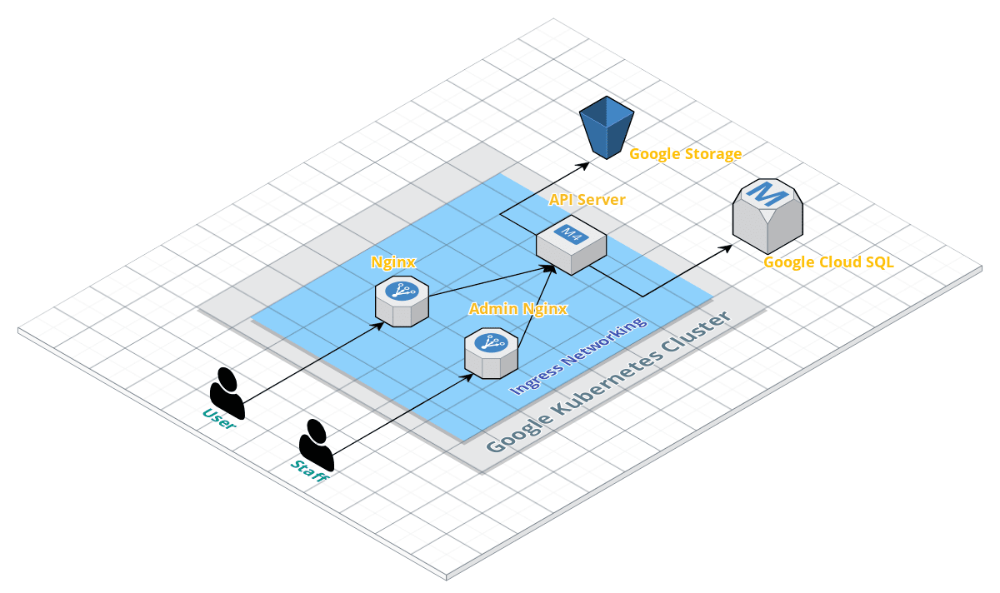

# Froggy's service
Project setup using [cookiecutter-django-vue](https://github.com/vchaptsev/cookiecutter-django-vue)

### Development

Create your own `.env` file at root, e.g. using `.env.example`:
```
$ sudo cp .env.example .env
```
```
$ docker-compose up --build
```

Cusotm your compose file e.g. `docker-compose.custom.yml`:
```
$ docker-compose -f docker-compose.custom.yml up --build
```

### Architecture



### Frontend

Project setup

    npm install

Compiles and hot-reloads for development

    npm run serve


Compiles and minifies for production

    npm run build


Run your tests

    npm run test


Lints and fixes files

    npm run lint


Customize configuration
* See [Configuration Reference](https://cli.vuejs.org/config/).
* VSCode settings.json
    ```
    {
        "vetur.validation.template": false,
        "eslint.autoFixOnSave": true,
        "eslint.validate": [
            "javascript",
            "javascriptreact",
            { "language": "vue", "autoFix": true }
        ]
    }
    ```
* .eslintrc.js
    ```
    //https://vuejs.github.io/eslint-plugin-vue/user-guide/
    module.exports = {
      env: {
        browser: true
      },
      extends: [
        // add more generic rulesets here, such as:
        'plugin:vue/strongly-recommended',
        'standard'
      ],
      rules: {
        // override/add rules settings here, such as:
        'vue/html-closing-bracket-newline': ['error', {
          'multiline': 'never'
        }]
      }
    }
    ```
* .eslintignore
    ```
    build/*.js
    ```

### Backend

Requires

    pip install -r backend/requirements.txt

Django configuration

* settings
    Create and edit `local.py` in backend/config/settings to configure your local settings e.g. database. For safety, we list `local.py` in .gitignore.

    For example, use custom plugin:
    ```
    # local.py
    from .base import INSTALLED_APPS
    INSTALLED_APPS = INSTALLED_APPS + [
      'your_custom_apps'
    ]
    ```
* environment variable
    We use [django-environ](https://github.com/joke2k/django-environ), it's more easy for docker image building and CI testing.
    You might want to change it base on how your variable in Django settings are passing.

    For safety, use list `.env` in .gitignore.
